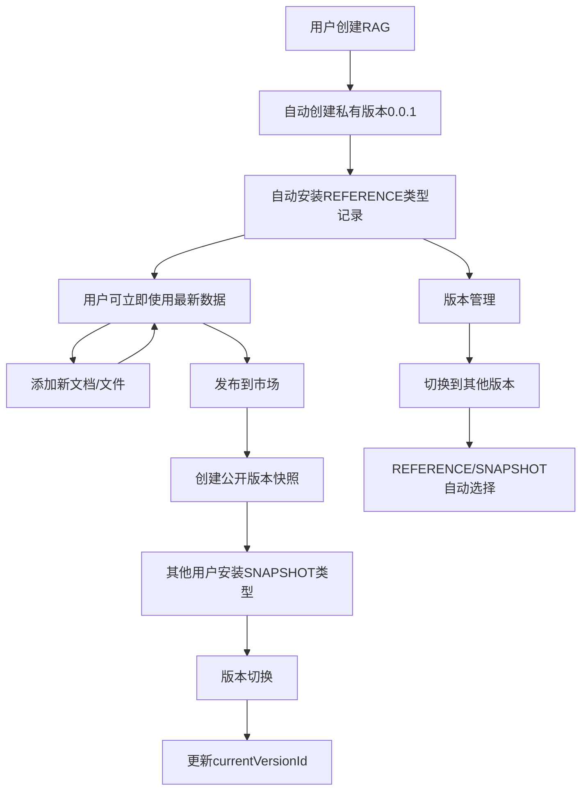

# RAG生命周期管理重构方案

## 问题背景

当前RAG管理系统存在以下核心问题：

1. **私有RAG使用困难**：用户创建的RAG添加新文档后，需要重新发布并审核才能在Agent中使用最新数据
2. **版本管理不灵活**：每个版本需要单独安装，无法像工具市场一样在已安装RAG中切换版本
3. **数据来源不统一**：Agent需要从多个数据源获取RAG，增加了复杂度

## 解决方案

### 核心设计思路

引入**动态引用机制**，区分两种安装类型：
- **REFERENCE类型**：引用原始数据集，支持实时更新（用于私有RAG）
- **SNAPSHOT类型**：使用版本快照，内容固定（用于公开RAG）

### 版本管理模式

对标工具市场的版本管理：
1. 安装RAG本身（而不是特定版本）
2. 支持在已安装RAG中切换版本
3. 统一从`user_rags`表获取可用RAG

## 技术实施方案

### 1. 数据库表结构调整

#### user_rags表重新设计
```sql
ALTER TABLE user_rags ADD COLUMN original_rag_id VARCHAR(64) COMMENT '原始RAG数据集ID';
ALTER TABLE user_rags ADD COLUMN install_type VARCHAR(20) DEFAULT 'SNAPSHOT' COMMENT '安装类型：REFERENCE/SNAPSHOT';
ALTER TABLE user_rags ADD COLUMN current_version_id VARCHAR(64) COMMENT '当前选择的版本ID';

-- 为向后兼容，保留 rag_version_id 字段
-- 新增复合索引
CREATE INDEX idx_user_original_rag ON user_rags(user_id, original_rag_id);
CREATE INDEX idx_user_install_type ON user_rags(user_id, install_type);
```

#### 安装类型枚举
- `REFERENCE`：动态引用原始数据集，数据实时更新
- `SNAPSHOT`：使用版本快照数据，内容固定不变

### 2. 领域模型重构

#### 新增InstallType枚举
```java
public enum InstallType {
    REFERENCE("REFERENCE", "引用类型"),
    SNAPSHOT("SNAPSHOT", "快照类型");
}
```

#### UserRagEntity实体扩展
新增字段：
- `originalRagId`：原始RAG数据集ID
- `installType`：安装类型
- `currentVersionId`：当前选择的版本ID

### 3. 核心业务逻辑重构

#### 创建RAG时的自动安装
```java
// RagQaDatasetAppService.createDataset()
1. 创建原始数据集
2. 创建0.0.1私有版本（用于版本管理）
3. 自动为创建者安装REFERENCE类型记录
   - originalRagId: 数据集ID
   - installType: REFERENCE  
   - currentVersionId: 0.0.1版本ID
```

#### RAG安装逻辑重构
```java
// UserRagDomainService.installRag()
1. 检查是否已安装同一个RAG（按originalRagId检查）
2. 如果已安装，则更新版本；如果未安装，则创建新记录
3. 自己的RAG：安装REFERENCE类型
4. 他人的RAG：安装SNAPSHOT类型
```

#### 版本切换功能
```java
// UserRagDomainService.switchRagVersion()
1. 验证用户是否已安装该RAG
2. 验证目标版本是否可用
3. 更新currentVersionId
4. 如果切换到私有版本，更新installType为REFERENCE
```

### 4. Agent集成机制

#### 统一RAG数据获取
```java
// RagDataService.getRagData()
根据installType决定数据来源：
- REFERENCE类型：从原始数据集表获取最新数据
- SNAPSHOT类型：从版本快照表获取固定数据
```

#### 检索服务适配
```java
// 检索时的数据路由
if (userRag.getInstallType() == REFERENCE) {
    // 从 rag_qa_dataset, rag_files, rag_documents 表查询
    return getRealTimeRagData(userRag.getOriginalRagId());
} else {
    // 从 rag_version_files, rag_version_documents 表查询  
    return getSnapshotRagData(userRag.getCurrentVersionId());
}
```

## RAG生命周期管理

### 完整生命周期



### 生命周期阶段详解

#### 1. 创建阶段
- **操作**：用户创建新的RAG数据集
- **系统行为**：
  - 创建原始数据集记录
  - 自动创建0.0.1私有版本
  - 为创建者安装REFERENCE类型记录
- **用户体验**：创建后立即可在Agent中使用

#### 2. 私有使用阶段  
- **特点**：动态数据，实时更新
- **数据来源**：原始数据集表
- **版本管理**：始终使用最新数据，无需发布
- **权限**：仅创建者可用

#### 3. 发布阶段
- **操作**：创建公开版本，提交审核
- **系统行为**：
  - 创建版本快照（完整复制数据）
  - 设置发布状态为待审核
- **审核通过**：版本状态变为已发布

#### 4. 市场安装阶段
- **操作**：其他用户从市场安装RAG
- **系统行为**：
  - 创建SNAPSHOT类型安装记录
  - 指向已发布的版本快照
- **用户体验**：使用稳定的版本数据

#### 5. 版本管理阶段
- **功能**：在已安装RAG中切换版本
- **支持的切换**：
  - 创建者：可切换到任何版本（包括私有版本）
  - 其他用户：只能切换到已发布版本
- **数据适配**：根据版本类型自动选择数据来源

## 关键特性

### 1. 统一入口
- 所有可用RAG都从`user_rags`表获取
- Agent集成逻辑简化，只需处理一个数据源

### 2. 灵活的版本管理
- 支持版本切换，无需重复安装
- 对标工具市场的用户体验

### 3. 智能数据路由
- REFERENCE类型：自动使用最新数据
- SNAPSHOT类型：使用稳定的版本快照
- 系统自动选择合适的数据来源

### 4. 权限控制
- 创建者：可使用私有版本（REFERENCE类型）
- 其他用户：只能使用已发布版本（SNAPSHOT类型）
- 安装类型自动判断，无需用户手动选择

### 5. 向后兼容
- 保留原有字段结构
- 渐进式迁移，不影响现有功能

## 实施计划

### Phase 1：数据模型扩展
1. 数据库表结构调整
2. 实体类和枚举定义
3. 数据迁移脚本

### Phase 2：领域服务重构
1. UserRagDomainService改造
2. 版本切换功能实现
3. 安装逻辑重构

### Phase 3：数据获取适配
1. RAG数据获取服务改造
2. 检索服务数据路由
3. Agent集成测试

### Phase 4：前端功能升级
1. 版本切换UI实现
2. 安装状态显示优化
3. 用户体验完善

### Phase 5：数据迁移和测试
1. 现有数据迁移
2. 完整功能测试
3. 性能优化

## 预期收益

### 用户体验提升
- **私有RAG**：添加文档后立即可用，无需发布审核
- **版本管理**：灵活切换版本，类似工具市场体验
- **操作简化**：统一的RAG管理界面

### 技术架构优化
- **代码简化**：统一数据入口，减少复杂度
- **扩展性强**：支持更多RAG类型和功能
- **维护性好**：清晰的生命周期和状态管理

### 业务价值
- **降低使用门槛**：私有RAG无需审核即可使用
- **提升活跃度**：更便捷的RAG管理和使用
- **支持协作**：清晰的公私有RAG边界