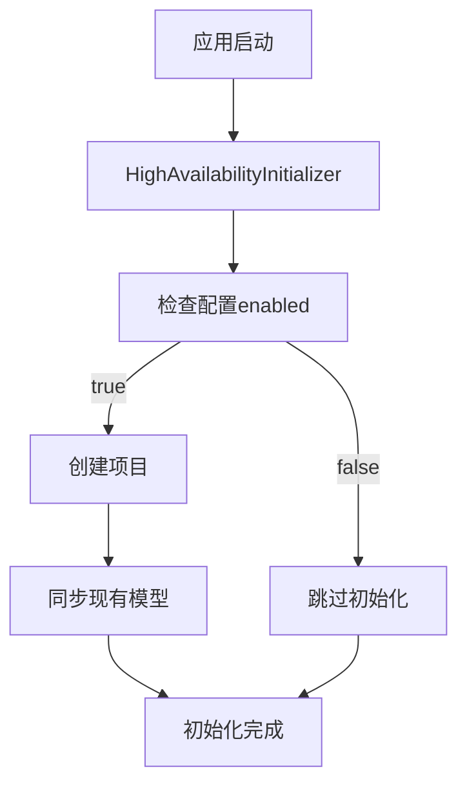
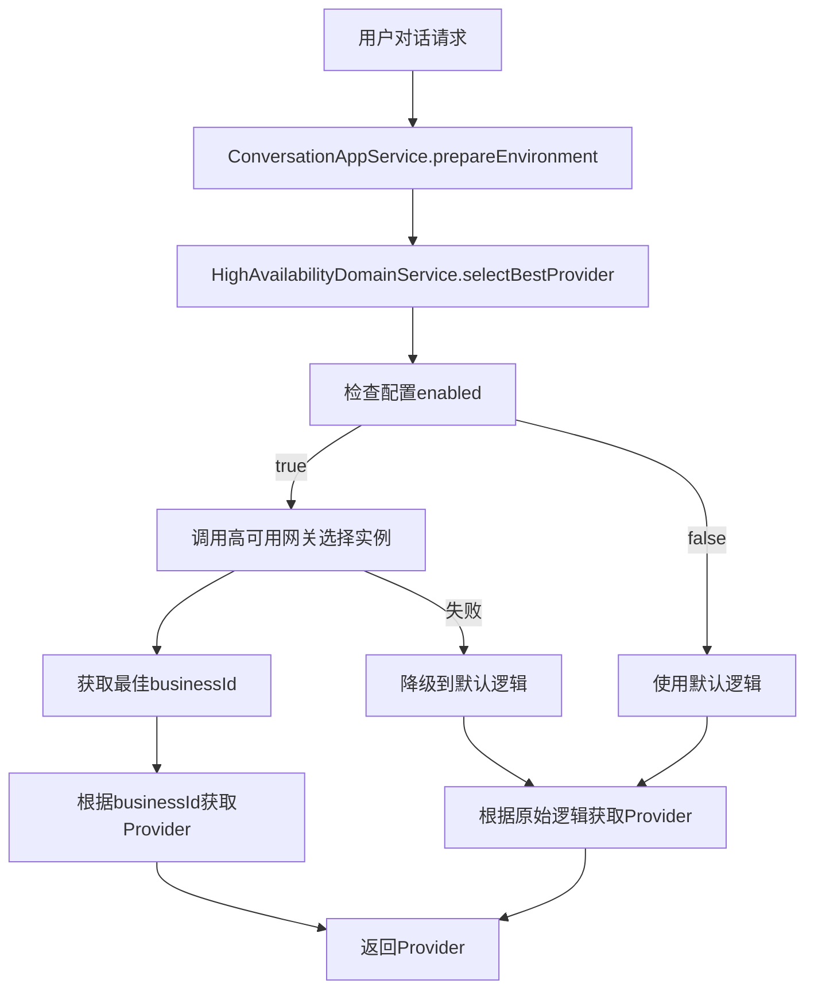
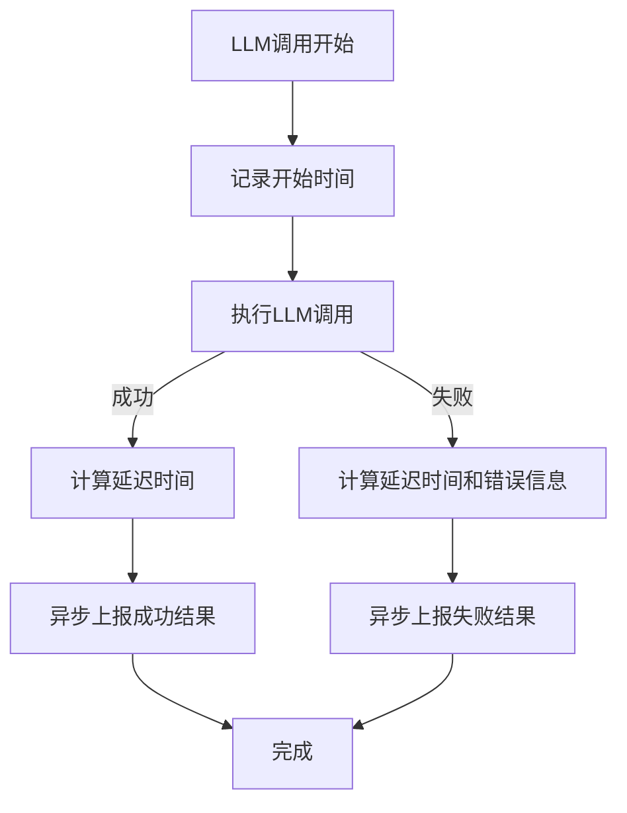

# AgentX 高可用集成说明

## 概述

本文档描述了 AgentX 项目与高可用 API-Premium-Gateway 项目的集成方案。通过这个集成，AgentX 可以实现 LLM 模型的高可用调用，提高系统的稳定性和可靠性。

## 架构设计

### 1. 设计原则

- **可插拔**: 通过配置开关控制是否启用高可用功能
- **降级友好**: 高可用失败时自动降级到原有逻辑
- **最小侵入**: 对现有代码改动最小
- **异步上报**: 调用结果异步上报，不影响主流程性能

### 2. 核心组件

```
domain层
├── llm/
│   ├── event/                     # 领域事件
│   │   ├── ModelDomainEvent.java
│   │   ├── ModelCreatedEvent.java
│   │   ├── ModelUpdatedEvent.java
│   │   └── ModelDeletedEvent.java
│   └── service/
│       └── HighAvailabilityDomainService.java  # 高可用领域服务接口

application层
└── llm/service/
    └── HighAvailabilityEventHandler.java       # 事件处理器

infrastructure层
├── config/
│   └── HighAvailabilityProperties.java         # 配置属性
├── highavailability/
│   ├── client/
│   │   └── HighAvailabilityGatewayClient.java  # HTTP客户端
│   ├── dto/request/                            # 请求对象
│   │   ├── SelectInstanceRequest.java
│   │   └── ReportResultRequest.java
│   ├── service/
│   │   └── HighAvailabilityDomainServiceImpl.java  # 领域服务实现
│   └── initializer/
│       └── HighAvailabilityInitializer.java    # 启动初始化器
```

### 3. 工作流程

#### 3.1 初始化流程


#### 3.2 模型选择流程


#### 3.3 结果上报流程


## 配置说明

### application.yml 配置

```yaml
# 高可用网关配置
high-availability:
  enabled: false  # 是否启用高可用功能
  gateway-url: ${HIGH_AVAILABILITY_GATEWAY_URL:http://localhost:8080}  # 高可用网关地址
  api-key: ${HIGH_AVAILABILITY_API_KEY:your-api-key}  # API密钥
  connect-timeout: 30000  # 连接超时时间(毫秒)
  read-timeout: 60000     # 读取超时时间(毫秒)
```

### 环境变量配置

```bash
# 启用高可用
HIGH_AVAILABILITY_ENABLED=true

# 高可用网关地址
HIGH_AVAILABILITY_GATEWAY_URL=http://your-gateway-host:8080

# API密钥
HIGH_AVAILABILITY_API_KEY=your-actual-api-key
```

## 使用方式

### 1. 启用高可用

1. 确保高可用网关项目已部署并运行
2. 在 AgentX 配置中设置 `high-availability.enabled=true`
3. 配置正确的网关地址和 API 密钥
4. 重启 AgentX 应用

### 2. 模型管理

高可用模式下的模型管理会自动同步到高可用网关：

- **创建模型**: 新模型会自动注册到高可用网关
- **更新模型**: 模型变更会同步到高可用网关
- **删除模型**: 从高可用网关中移除模型实例

### 3. 调用监控

高可用模式下，所有 LLM 调用的结果会自动上报到高可用网关，包括：

- 调用延迟
- 成功/失败状态
- 错误信息（如果有）
- Token 使用情况

## API 说明

### 高可用网关 API

#### 1. 选择最佳实例

```http
POST /gateway/select-instance
Content-Type: application/json
api-key: your-api-key

{
  "projectId": "agentx-project",
  "userId": "user123",
  "apiIdentifier": "gpt-4",
  "apiType": "MODEL"
}
```

#### 2. 上报调用结果

```http
POST /gateway/report-result
Content-Type: application/json
api-key: your-api-key

{
  "projectId": "agentx-project",
  "instanceId": "model-instance-id",
  "businessId": "business-id",
  "success": true,
  "latencyMs": 1200,
  "callTimestamp": 1672531200000
}
```

## 故障处理

### 1. 降级机制

当高可用网关不可用时，系统会自动降级到原有的模型选择逻辑：

```java
try {
    // 尝试通过高可用网关选择
    return highAvailabilityGatewayClient.selectBestInstance(request);
} catch (Exception e) {
    logger.warn("高可用网关选择失败，降级到默认逻辑", e);
    // 降级到原有逻辑
    return llmDomainService.getProvider(model.getProviderId(), userId);
}
```

### 2. 错误处理

- **网络连接失败**: 自动重试 + 降级
- **认证失败**: 记录错误日志，使用默认逻辑
- **超时**: 设置合理的超时时间，避免阻塞主流程

### 3. 监控告警

建议监控以下指标：

- 高可用网关可用性
- 降级频率
- 调用延迟
- 错误率

## 性能考虑

### 1. 异步处理

- 模型同步使用 `@Async` 异步处理
- 结果上报使用异步方式，不阻塞主流程

### 2. 连接池

HTTP 客户端使用连接池，提高并发性能：

```java
private final CloseableHttpClient httpClient = HttpClients.createDefault();
```

### 3. 超时设置

合理设置连接和读取超时时间：

- 连接超时: 30 秒
- 读取超时: 60 秒

## 最佳实践

### 1. 测试建议

- 在测试环境先验证集成功能
- 测试高可用网关故障时的降级行为
- 验证模型同步功能的正确性

### 2. 部署建议

- 使用蓝绿部署避免服务中断
- 监控高可用网关的健康状态
- 设置合适的日志级别便于排查问题

### 3. 运维建议

- 定期检查模型同步状态
- 监控调用延迟和成功率
- 建立告警机制及时发现问题

## 注意事项

1. **配置管理**: 确保 API 密钥的安全性，不要在代码中硬编码
2. **版本兼容**: 注意 AgentX 和高可用网关的版本兼容性
3. **数据一致性**: 模型变更时注意数据同步的一致性
4. **资源清理**: 删除模型时确保高可用网关中的实例也被正确清理

## 问题排查

### 常见问题

1. **高可用功能未生效**
   - 检查配置 `high-availability.enabled` 是否为 `true`
   - 验证网关地址和 API 密钥是否正确

2. **模型同步失败**
   - 查看应用启动日志中的错误信息
   - 检查高可用网关是否正常运行

3. **调用延迟增加**
   - 检查网络连接质量
   - 验证高可用网关的性能

### 日志查看

相关日志都会记录在 AgentX 的日志文件中，关键日志包括：

```
[INFO] 高可用系统初始化完成
[INFO] 通过高可用网关选择Provider成功: modelId=xxx, providerId=xxx
[WARN] 高可用网关选择Provider失败，降级到默认逻辑
[ERROR] 同步模型到高可用网关失败: modelId=xxx
``` 