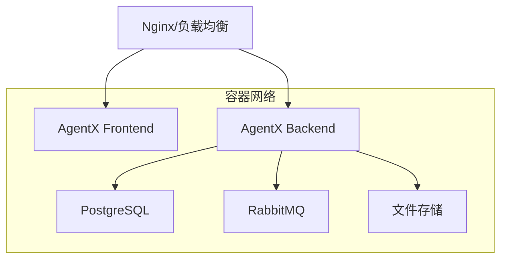

# AgentX Docker 部署详细指南

本文档提供 AgentX 系统的完整部署指南，包括环境配置、服务部署、监控维护等详细说明。

## 📋 目录

- [系统要求](#系统要求)
- [部署架构](#部署架构)
- [环境配置](#环境配置)
- [部署流程](#部署流程)
- [服务管理](#服务管理)
- [数据管理](#数据管理)
- [监控维护](#监控维护)
- [安全配置](#安全配置)
- [故障排查](#故障排查)

## 🔧 系统要求

### 硬件要求

| 环境 | CPU | 内存 | 存储 | 网络 |
|------|-----|------|------|------|
| 开发环境 | 2核+ | 4GB+ | 20GB+ | 1Mbps+ |
| 测试环境 | 4核+ | 8GB+ | 50GB+ | 10Mbps+ |
| 生产环境 | 8核+ | 16GB+ | 100GB+ | 100Mbps+ |

### 软件要求

- **操作系统**: Linux (Ubuntu 20.04+/CentOS 8+), macOS 10.15+, Windows 10+
- **Docker**: 20.10.0+ 
- **Docker Compose**: 2.0.0+
- **Git**: 2.0+

### 网络要求

**开放端口**:
- `3000` - 前端服务
- `8080` - 后端API
- `5432` - PostgreSQL (内置模式)
- `5672` - RabbitMQ
- `15672` - RabbitMQ管理界面
- `8081` - Adminer (开发模式)

## 🏗 部署架构

### 服务组件



### 部署模式对比

| 特性 | Local | Production | External | Dev |
|------|-------|------------|----------|-----|
| 数据库 | 内置PostgreSQL | 内置PostgreSQL | 外部PostgreSQL | 内置PostgreSQL |
| 性能优化 | ❌ | ✅ | ✅ | ❌ |
| 开发工具 | ❌ | ❌ | ❌ | ✅ |
| 热重载 | ✅ | ❌ | ❌ | ✅ |
| 生产就绪 | ❌ | ✅ | ✅ | ❌ |

## ⚙️ 环境配置

### 配置文件说明

AgentX 使用分层配置模式：

1. **默认配置** - `application.yml` 中的默认值
2. **环境配置** - `.env` 文件中的环境变量
3. **运行时配置** - Docker 容器环境变量

### 配置优先级

```
Docker环境变量 > .env文件 > application.yml默认值
```

### 核心配置项

#### 数据库配置

```bash
# 数据库主机 (external模式必填)
DB_HOST=localhost
DB_PORT=5432
DB_NAME=agentx
DB_USER=agentx_user
DB_PASSWORD=your_secure_password

# 连接池配置
DB_MAX_POOL_SIZE=20
DB_MIN_IDLE=5
DB_CONNECTION_TIMEOUT=30000
```

#### 应用配置

```bash
# 服务端口
SERVER_PORT=8080
FRONTEND_PORT=3000

# API配置
NEXT_PUBLIC_API_BASE_URL=http://localhost:8080/api

# Spring配置
SPRING_PROFILES_ACTIVE=prod
JPA_DDL_AUTO=validate
SHOW_SQL=false
```

#### 用户配置

```bash
# 管理员用户
AGENTX_ADMIN_EMAIL=admin@your-domain.com
AGENTX_ADMIN_PASSWORD=your_admin_password
AGENTX_ADMIN_NICKNAME=系统管理员

# 测试用户 (生产环境建议禁用)
AGENTX_TEST_ENABLED=false
AGENTX_TEST_EMAIL=test@your-domain.com
AGENTX_TEST_PASSWORD=your_test_password
```

#### 安全配置

```bash
# JWT密钥 (生产环境必须修改)
JWT_SECRET=your_jwt_secret_key_here

# 消息队列认证
RABBITMQ_USERNAME=agentx_mq
RABBITMQ_PASSWORD=your_rabbitmq_password
```

## 🚀 部署流程

### 1. 环境准备

```bash
# 1. 克隆项目
git clone <repository-url>
cd AgentX-2

# 2. 切换到部署目录
cd deploy

# 3. 检查Docker环境
docker --version
docker compose version
```

### 2. 配置选择

选择适合的部署模式：

#### 本地开发环境
```bash
# 适用于日常开发
./start.sh local
```

#### 生产环境部署
```bash
# 适用于生产环境
./start.sh production
```

#### 外部数据库模式
```bash
# 适用于大型部署
./start.sh external
```

#### 开发增强模式
```bash
# 包含管理工具
./start.sh dev
```

### 3. 自定义配置

```bash
# 1. 复制配置模板
cp .env.production.example .env

# 2. 编辑配置文件
vim .env

# 3. 启动服务
docker compose --profile production up -d
```

### 4. 验证部署

```bash
# 检查服务状态
docker compose ps

# 查看日志
docker compose logs -f

# 测试API
curl http://localhost:8080/api/health

# 访问前端
open http://localhost:3000
```

## 🔄 服务管理

### 常用命令

```bash
# 启动服务
docker compose up -d

# 停止服务
docker compose down

# 重启服务
docker compose restart

# 查看状态
docker compose ps

# 查看日志
docker compose logs -f [service-name]

# 进入容器
docker compose exec agentx-backend bash
```

### 服务更新

```bash
# 1. 停止服务
docker compose down

# 2. 拉取最新代码
git pull

# 3. 重新构建
docker compose build --no-cache

# 4. 启动服务
docker compose up -d
```

### 配置更新

```bash
# 1. 修改配置文件
vim .env

# 2. 重启相关服务
docker compose restart agentx-backend agentx-frontend
```

## 💾 数据管理

### 数据持久化

AgentX 使用 Docker Volumes 进行数据持久化：

```bash
# 查看数据卷
docker volume ls

# 数据卷说明
postgres-data     # 数据库数据
rabbitmq-data     # 消息队列数据
storage-data      # 应用文件存储
```

### 数据备份

#### 自动备份脚本

```bash
#!/bin/bash
# backup.sh

BACKUP_DIR="/backup/agentx"
DATE=$(date +%Y%m%d_%H%M%S)

# 创建备份目录
mkdir -p $BACKUP_DIR

# 备份数据库
docker exec agentx-postgres pg_dump -U agentx_user agentx | gzip > $BACKUP_DIR/database_$DATE.sql.gz

# 备份文件存储
docker run --rm -v agentx_storage-data:/data -v $BACKUP_DIR:/backup alpine tar czf /backup/storage_$DATE.tar.gz -C /data .

echo "备份完成: $DATE"
```

#### 手动备份

```bash
# 数据库备份
docker exec agentx-postgres pg_dump -U agentx_user agentx > backup_$(date +%Y%m%d).sql

# 文件存储备份
docker run --rm -v agentx_storage-data:/data -v $(pwd):/backup alpine \
  tar czf /backup/storage_backup_$(date +%Y%m%d).tar.gz -C /data .
```

### 数据恢复

```bash
# 数据库恢复
docker exec -i agentx-postgres psql -U agentx_user -d agentx < backup.sql

# 文件存储恢复
docker run --rm -v agentx_storage-data:/data -v $(pwd):/backup alpine \
  tar xzf /backup/storage_backup.tar.gz -C /data
```

## 📊 监控维护

### 健康检查

AgentX 内置健康检查端点：

```bash
# 系统健康状态
curl http://localhost:8080/api/health

# 数据库连接状态
docker exec agentx-postgres pg_isready -U agentx_user

# 消息队列状态
curl http://localhost:15672/api/overview
```

### 日志管理

#### 查看日志

```bash
# 实时日志
docker compose logs -f

# 特定服务日志
docker compose logs -f agentx-backend

# 历史日志
docker compose logs --since="2024-01-01" agentx-backend
```

#### 日志轮转

```yaml
version: '3.8'
services:
  agentx-backend:
    logging:
      driver: "json-file"
      options:
        max-size: "10m"
        max-file: "5"
```

### 性能监控

#### 资源使用

```bash
# 容器资源使用
docker stats

# 系统资源
top
df -h
free -m
```

#### 数据库监控

```bash
# 连接数
docker exec agentx-postgres psql -U agentx_user -d agentx -c "SELECT count(*) FROM pg_stat_activity;"

# 表大小
docker exec agentx-postgres psql -U agentx_user -d agentx -c "\\dt+"
```

## 🔒 安全配置

### 生产环境安全检查清单

- [ ] 修改默认密码
  - [ ] 数据库密码 (`DB_PASSWORD`)
  - [ ] 管理员密码 (`AGENTX_ADMIN_PASSWORD`)
  - [ ] RabbitMQ密码 (`RABBITMQ_PASSWORD`)
- [ ] 配置JWT密钥 (`JWT_SECRET`)
- [ ] 禁用测试用户 (`AGENTX_TEST_ENABLED=false`)
- [ ] 配置HTTPS (通过反向代理)
- [ ] 限制数据库端口对外暴露
- [ ] 配置防火墙规则
- [ ] 启用日志审计

### 网络安全

#### 反向代理配置 (Nginx)

```nginx
server {
    listen 80;
    server_name your-domain.com;
    return 301 https://$server_name$request_uri;
}

server {
    listen 443 ssl http2;
    server_name your-domain.com;
    
    ssl_certificate /path/to/certificate.crt;
    ssl_certificate_key /path/to/private.key;
    
    location / {
        proxy_pass http://localhost:3000;
        proxy_set_header Host $host;
        proxy_set_header X-Real-IP $remote_addr;
    }
    
    location /api/ {
        proxy_pass http://localhost:8080/api/;
        proxy_set_header Host $host;
        proxy_set_header X-Real-IP $remote_addr;
    }
}
```

#### 防火墙配置

```bash
# Ubuntu/Debian
ufw allow 22/tcp
ufw allow 80/tcp
ufw allow 443/tcp
ufw --force enable

# CentOS/RHEL
firewall-cmd --permanent --add-service=ssh
firewall-cmd --permanent --add-service=http
firewall-cmd --permanent --add-service=https
firewall-cmd --reload
```

## 🔍 故障排查

### 常见问题

#### 1. 服务无法启动

**症状**: 容器启动失败或立即退出

**排查步骤**:
```bash
# 查看详细日志
docker compose logs agentx-backend

# 检查配置文件
docker compose config

# 验证网络连接
docker compose exec agentx-backend ping postgres
```

#### 2. 数据库连接失败

**症状**: 后端服务报数据库连接错误

**排查步骤**:
```bash
# 检查数据库状态
docker compose ps postgres

# 测试数据库连接
docker exec agentx-postgres pg_isready -U agentx_user

# 查看数据库日志
docker compose logs postgres
```

#### 3. 前端无法访问后端

**症状**: 前端显示API请求失败

**排查步骤**:
```bash
# 检查后端健康状态
curl http://localhost:8080/api/health

# 验证网络连通性
docker compose exec agentx-frontend ping agentx-backend

# 检查环境变量
docker compose exec agentx-frontend env | grep NEXT_PUBLIC
```

### 调试模式

#### 启用调试日志

```bash
# 修改环境变量
LOG_LEVEL_ROOT=debug
LOG_LEVEL_APP=debug

# 重启服务
docker compose restart agentx-backend
```

#### 远程调试

开发环境支持Java远程调试：

```bash
# 调试端口已暴露: 5005
# IDE连接配置:
# Host: localhost
# Port: 5005
# Transport: Socket
# Debugger mode: Attach
```

## 📈 性能优化

### JVM 调优

```bash
# 生产环境JVM参数
JAVA_OPTS="-Xms2g -Xmx4g -XX:+UseG1GC -XX:MaxGCPauseMillis=200 -XX:+HeapDumpOnOutOfMemoryError"
```

### 数据库优化

```sql
-- 连接池配置
-- 在 application.yml 中配置
spring:
  datasource:
    hikari:
      maximum-pool-size: 20
      minimum-idle: 5
      connection-timeout: 30000
      idle-timeout: 600000
      max-lifetime: 1800000
```

### 缓存配置

```yaml
# Redis缓存 (可选)
spring:
  cache:
    type: redis
  redis:
    host: ${REDIS_HOST:localhost}
    port: ${REDIS_PORT:6379}
    password: ${REDIS_PASSWORD:}
```

## 📞 技术支持

### 获取帮助

1. **文档资源**
   - [项目README](../../README.md)
   - [故障排查文档](./TROUBLESHOOTING.md)
   - [Docker重构计划](./DOCKER_REFACTOR_PLAN.md)

2. **社区支持**
   - GitHub Issues: 报告问题和功能请求
   - 技术讨论: 项目技术交流

3. **日志收集**
   ```bash
   # 收集完整日志用于问题排查
   ./collect-logs.sh
   ```

---

*最后更新: 2025-01-08*  
*文档版本: v2.0*